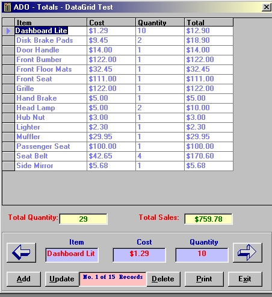



## ADOTotalsShow

### Description

This project demonstrates a number of important ADO Data Base - VB methods and utilities.

1. Paramount of these utilites, from my perspective, is how to get the totals

from a database field as well as how to multiply the items in two DB Fields and then create another field to show the answer. In addition a running total is kept, showing the Sum of the multiplied fields. This is a feature that any inventory data base requires.

2. Make an ADO Connection without using the ADO Data Control. When a program uses the ADO Data Control(s) it hard connects the data base to a given directory

("C:\My Documents\MyDataBase.mdb"), or

worse yet the directory that the program is design / built in;

(C:\Program Files\Microsoft Visual Studio\VB98\MyDataBaseProgram\etc").

This connection causes havoc when the product is installed to a client's computer. Of course a work around for this is to make a DSN Connection,

but this requires the inclusion of numerous files in your setup/install program. When the connection is made through the use of code as opposed to using the ADO Data Control the Database file is located / installed in

the program's deployed directory and is easily connected to.

3. Deploy and show all of the data using the MS DataGrid Control. Program shows how to fill and set the Data Grid. This demo allows adding and

deleting of records directly on the Data Grid (Although this method is not recommended due to lack of ease, the better method is to use the

programs Text Boxes).

4. Program sets up a TextBox and recordset movement procedure that emulates the familiar data control methods, i.e., The user can move

through the records - movement is apparent in both the Data Grid and the Text Boxes, and the Current Record and Number of Records are continously displayed and updated when records are added or deleted.

5. Program makes use of the MS Report Designer in lieu of Crystal Reports. I have used Crystal Reports in the past and had numerous problems. I now use the MS Data Report exclusively. If you have any questions/problems with this demo it will be in this area. Study the  DataEnviornment and DataReport Designers Structure
 
### More Info
 

             |
---                |---
**Submitted On**   |2001-06-18 12:00:00
**By**             |[John Cunningham](https://github.com/Planet-Source-Code/PSCIndex/blob/master/ByAuthor/john-cunningham.md)
**Level**          |Advanced
**User Rating**    |4.7 (98 globes from 21 users)
**Compatibility**  |VB 6\.0
**Category**       |[Databases/ Data Access/ DAO/ ADO](https://github.com/Planet-Source-Code/PSCIndex/blob/master/ByCategory/databases-data-access-dao-ado__1-6.md)
**World**          |[Visual Basic](https://github.com/Planet-Source-Code/PSCIndex/blob/master/ByWorld/visual-basic.md)
**Archive File**   |[ADOTotalsS213386182001\.zip](https://github.com/Planet-Source-Code/john-cunningham-adototalsshow__1-24202/archive/master.zip)

